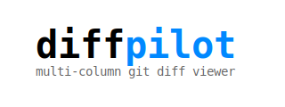
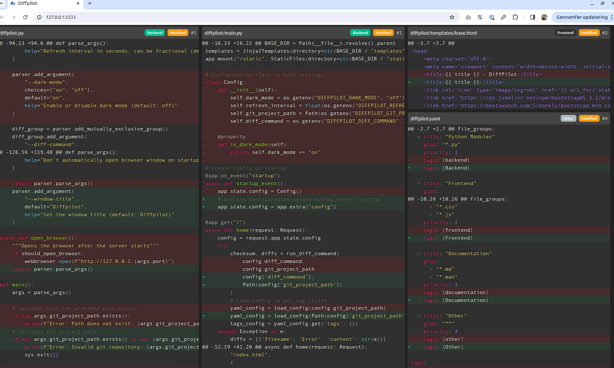

# diffpilot

Diffpilot serves a local web interface for viewing git diffs across multiple columns on large monitors. Files can be grouped and sorted based on patterns and priorities, and tagged for better overview. All configuration is done in the diffpilot.yaml file in your git repository.



## Installation

```bash
pip install diffpilot
```

## Quick start

```bash
cd /path/to/your/repo
diffpilot .
```

Point your browser to http://localhost:3333 if it doesn't open automatically.

## Configuration

Create a `diffpilot.yaml` in your repository root:

```yaml
file_groups:
  - title: "Django Models"
    glob: "*/models.py"
    priority: 10
    tags: [models, python, core]
  - title: "Tests"
    glob: "*/tests/*.py"
    priority: 8
    tags: [tests, python]

tags:
  models:
    css_class: "bg-primary"
  python:
    css_class: "custom-python"

extra_css: "./diffpilot.css"  # Optional
```

## Usage examples

```bash
# Show all changes, including:
# - Untracked files not yet in git
# - Modified tracked files
# - Staged changes
# - Uncommitted changes
# Runs two git commands:
# 1. Show diffs for untracked files
# 2. Show diffs for tracked changes
diffpilot . --diff-local

# Show changes in current branch compared to main, including:
# - Untracked files not yet in git
# - Modified tracked files
# - Staged changes
# - Uncommitted changes
# - Differences from the point where current branch diverged from main
# Runs two git commands:
# 1. Show diffs for untracked files
# 2. Show diffs compared to branch divergence point
diffpilot . --diff-branch main

# Start with 5 second refresh
diffpilot -n 5 .

# Use a different port
diffpilot -p 8080 /path/to/project

# Show staged changes
diffpilot . --diff-command="git diff --cached"

# Set custom window title
diffpilot . --window-title "My Project Diffs"
```

## Options

```
-p, --port=NUMBER         Web server port (default: 3333)
-n, --interval=SECONDS    Refresh interval, can be fractional (default: 2.0)
--diff-command=COMMAND    Custom diff command
--diff-local              Show all uncommitted changes (untracked, modified, staged)
--diff-branch=BRANCH      Show changes in current branch compared to specified branch
--window-title=TITLE      Set custom window title (default: Diffpilot)
--no-open                 Don't open browser automatically
-h, --help                Show help message
```

## File Groups Matching

When multiple file groups match a file, the **first matching group** in the configuration file will be used for priority, and tags. Order your file groups from most specific to most general.

## Tag styling

Tags are rendered as Bootstrap badges and can be styled using Bootstrap background classes or custom CSS. See the [Flatly theme badges](https://bootswatch.com/flatly/) for available styles.

## Contributing

Pull requests are welcome! For major changes, please open an issue first to discuss what you would like to change.

## License

[MIT](https://opensource.org/licenses/MIT)